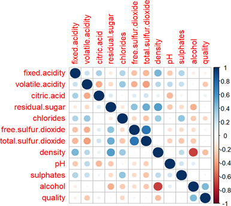
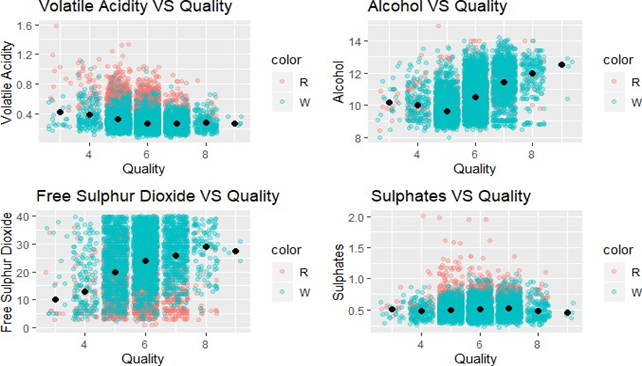

# Wine-Quality-Analysis-using-R
## Objective
This project aims to analyze the quality of the Portuguese 'Vinho Verde' wine to build a model to predict the quality of the two variants(red and white) of the wine in terms of the selected variables in the best possible way.
## Steps involved in the analysis
1.  In order to choose the predictor variables for the model, we first checked the correlation among variables. 

3.  Chose the factors which would significantly affect the quality of the wine.

5.  Checked on the assumptions for the predictor and outcome variables that should be met to build a regression model to predict the quality of the wine.
6.  Assessed the model by doing residual analysis(Durbin Watson test), VIF & tolerance values and Cook's distance to check for influencial cases.

## Conclusion
With all the assumptions and diagnostics of our model intact we coud say that our model can account for 27.27% of variation in quality of wine. The project report also addresses the issue of biased dataset in terms of the number of observations for the two variants of wine, unbalanced classes and little information on the environmental factors that affect the quality of the wine.
